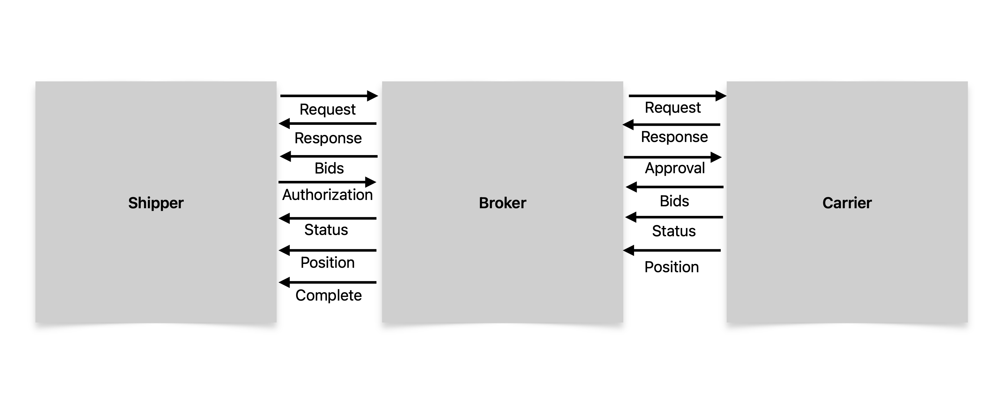

# v1.0.0 Simple Logistics Information Protocol (SLIP) 

The Simple Logistics Information Protocol (SLIP) is a lightweight JSON based protocol for shippers, brokers, and carriers to share logistics quoting, status, and tracking information between servers.


## Table of Contents

- Motivation
- Features
- Expected Usage
- Shipper Server Requirements
- Broker Server Requirements
- Carrier Server Requirements
- Partial Implementation and Extensibility
- Definitions and Usage of SLIP Keys
- SLIP Examples
- Contributing

## Motivation

SLIPs were created due to the complexity of EDI and the number of differing EDI and HTTP API standards. This leads to fragmentation, data silos, and poor communication between logistics industry players.

## Features
#### Lightweight
SLIPs are extremely lightweight, yet contain enough information to quote, authorize, and track trips across any medium: air, ground, or sea. 
#### Modular and Extensible
The SLIP protocol does not require full implementation and can coexist alongside any existing quoting or tracking system.
#### Backwards Compatibile
SLIPs contain a key for EDI strings and another for the EDI string type. This allows SLIPs to be sent along with legacy EDI information if necessary or convenient.
#### Data Integrity
SLIPs contain a hash field which can be used between shippers and brokers to ensure that no data has been lost, and if it has, shippers can request the complete SLIP to catch their server up on the status and position reports.
#### Data Security 
Position SLIPs inlude a signature field which allows brokers and shippers up the chain to verify the identity of the carrier that sent the position report. The exact implementation of this is outside the scope of the protocol. 

## Expected Usage
The SLIP protocol is designed around a 3 player model of the logistics industry: shippers, brokers, and carriers. The expected implementation depends on your role and is illustrated in the image below.



### SLIP Types
Currently the protocol defines 7 types of SLIPs:
- Quote Request
- Quote Response
- Bid
- Quote Authorization
- Trip Approval
- Status Update
- Position Update
- Complete SLIP

### Quote Request
Used by Shippers to notify Brokers of a need for a logistics move. Also passed along with or without modification by Brokers to Carriers.

### Quote Response
Used by Brokers to provide Shippers with a quote for the request. Contains an array of bid SLIPs.

### Bid
Used by Carriers to send quotes to a Broker who relays them to Shipper. 

### Quote Authorization
Used by Shippers to notify Brokers that a trip has been authorized and should be dispatched.

### Trip Approval
Used by Brokers after a Qoute Authorization is received to notify Carriers to dispatch the trip.

### Status Update
Used by Carriers to notify Brokers of shipment status changes and relayed by Brokers to Shippers.

### Position Update
Used by Carriers to notify Brokers of the current lat/lng literal of the freight position. Relayed by Brokers to Shippers.

### Complete SLIP
Used by Brokers to inform Shippers of all current known information of a shipment. Can be used as an after trip summary, or anytime a Shipper's server fails to validate a hash of a SLIP (indicating that the Shipper's servers missed an update).

>NOTE: The `hash` field of any SLIP sent between the Shipper and Broker is always the hash of the `complete` SLIP (with all new additions added) not including the `hash` field itself, regardless of the type of SLIP you are sending. This means that to compute the hash you need to add all fields required for a `complete` SLIP even if the values are currently `null`. For SLIPs sent between Brokers and Carriers the `hash` field works differently. See the `hash` field in Definitions and Usage of SLIP Keys below.

## Shipper Server Requirements
Shipper server APIs are expected to send Quote Requests and Quote Authorizations, and to accept Quote Reponses, Status Updates, Position Updates, and (optionally) Complete SLIPs.

## Broker Server Requirements
Broker server APIs are expected to send and accept all forms of SLIPs, as they act as a relay between shippers and carriers. 

## Carrier Server Requirements
Carrier server APIs are expected to send Bids, Status Updates and Position Updates, and to accept Quote Requests, and Trip Approvals.

## Partial Implemenation and Extensibility
It is completely possible to use an existing quoting and authorization system separate from SLIPs and use SLIPs exclusively for status and position updates, or vice versa.

It is also completely possible to extend or augment SLIP objects with additional keys for custom, vendor-specific implementations, although these will not be recognized by all vendors or players.


## Definitions and Usage of SLIP Keys

| Key | Definition |
|----------|----------|
| `v` | SLIP protocol version e.g. `1.0.0` |
| `slipType` | The type of SLIP. Can be `request`, `response`, `auth`, `position`, `approval`, `status`, or `complete` |
| `slipId` | The unique ID of this SLIP |
| `slipInRefTo` | The unique ID of the SLIP this refers to. Usually the `slipId` of the original Quote Request SLIP. `null` if this is an original quote request |
| `pickupName` | The company name at the pickup address |
| `pickupStreetNumber` | The street number of the pickup address |
| `pickupStreetName` | The street name of the pickup address |
| `pickupCity` | The city of the pickup address |
| `pickupPostal` | The postal/ZIP code of the pickup address |
| `pickupRegion` | The state/province/region of the pickup address |
| `pickupCountry` | The country of the pickup address |
| `pickupCoordinates` | Object containing latitude and longitude coordinates of the pickup location |
| `deliveryName` | The company name at the delivery address |
| `deliveryStreetNumber` | The street number of the delivery address |
| `deliveryStreetName` | The street name of the delivery address |
| `deliveryCity` | The city of the delivery address |
| `deliveryPostal` | The postal/ZIP code of the delivery address |
| `deliveryRegion` | The state/province/region of the delivery address |
| `deliveryCountry` | The country of the delivery address |
| `deliveryCoordinates` | Object containing latitude and longitude coordinates of the delivery location |
| `totalWeight` | The total weight of the shipment |
| `weightMeasure` | The unit of measurement for weight (e.g. `lb`, `kg`) |
| `width` | The width of the shipment |
| `length` | The length of the shipment |
| `height` | The height of the shipment |
| `dimMeasure` | The unit of measurement for dimensions (e.g. `in`, `cm`) |
| `qty` | The quantity of containers/units in the shipment |
| `container` | The type of container. Can be `pallet`, `skid`, `tote`, `box`, `piece`, or `rack` |
| `brokenDown` | `boolean` indicating whether the freight can be broken down into individual units |
| `indWeight` | Individual unit weight. Can be null if `brokenDown` is `false` |
| `indWidth` | Individual unit width. Can be null if `brokenDown` is `false` |
| `indLength` | Individual unit length. Can be null if `brokenDown` is `false` |
| `indHeight` | Individual unit height. Can be null if `brokenDown` is `false` |
| `hazmatUNCode` | UN code for hazardous materials, or null if not applicable |
| `hazmatWeight` | Weight of hazardous materials. Uses same measurement unit as `weightMeasure` |
| `hazmatVol` | Volume of hazardous materials. Uses same measurement unit as `dimMeasure` (but cubic) |
| `requestedPickupDate` | The requested date for pickup in ISO format (`YYYY-MM-DD`) |
| `requestedPickupTime` | The requested time for pickup in 24-hour Zulu time format |
| `requestedDeliveryDate` | The requested date for delivery in ISO format (`YYYY-MM-DD`) |
| `requstedDeliveryTime` | The requested time for delivery in 24-hour Zulu time format `HH:MMZ` |
| `referenceNumber` | Reference or authorization number, usually a Broker providing the Shipper with their trip number or `null` if not applicable |
| `prefStatusCodeType` | Preferred type of status coding if using an EDI or other standard such as `ANSIX12` |
| `responseSlip` | Object containing the response SLIP or `null` if no response yet (on `complete` SLIPs only)|
| `statusSlips` | Array of status update SLIPs (on `complete` SLIPs only) can be `[]` if none yet|
| `positionSlips` | Array of position update SLIPs (on `complete` SLIPs only) can be `[]` if none yet|
| `bids` | Array of bid SLIPs (on `complete` and `response` SLIPs only) can be `[]` if none yet|
| `partial` | Boolean indicating if only part of the shipment can be taken. `null` for quote request SLIPs |
| `partialQty` | Quantity that can actually be shipped if less than requested qty. Null if `partial` is `null` or `false` |
| `partialContainerType` | Container type for partial shipment. Can be `pallet`, `skid`, `tote`, `box`, `piece`, or `rack`. Null if `partial` is null or false |
| `carrierScac` | The Standard Carrier Alpha Code identifying the carrier |
| `costDollars` | The dollar amount of the shipping cost |
| `costCents` | The cents portion of the shipping cost |
| `currency` | The currency code (e.g. `USD`, `CAD`, `EUR`) |
| `eta` | Estimated time of arrival in 24-hour Zulu time format |
| `createdAt` | UNIX `timestamp` when the SLIP was created. This is different from `requestedPickupDate` |
| `carrierReferenceNumber` | The carrier's trip or reference number, sometimes passed to the Shipper for tracking purposes, or `null` if not applicable |
| `hash` | The hash of the `complete` SLIP up to that point in the trip. Example: if sending a new position report, add the new position SLIP to the `positionSlips` array of the `complete` SLIP then hash the `complete` SLIP. The recipient will be able to do the same on their side to verify they have not missed any updates. The difference between a `complete` SLIP and a `response` SLIP is the presence of the `responseSlip` `statusSlips` and `positionSlips` fields (which may all be `null` or empty `array`s depending on the phase of the trip). NOTE: this is only used between Shippers and Brokers as Carriers do not necessarily have the complete SLIP. If Brokers want hash integrity monitoring on `position` and `status` SLIPs from Carriers it is recommended to hash the complete array of `position` SLIPs or `status` SLIPs respectively (up to that point in the trip) instead. |
| `authContactName` | The name of the contact person for authorization |
| `pickupCode` | Code assigned for the pickup location, sometimes called Supplier Code |
| `deliveryCode` | Code assigned for the delivery location, sometimes called Plant Code |
| `shipperNo` | Shipper number as a `string` (even if numeric) |
| `billOfLading` | Bill of lading number as a `string` (even if numeric) |
| `reasonCode` | Reason code for the shipment or transaction |
| `partNumbers` | Array of objects containing part numbers and quantities. Each object has `partNumber` (string) and `qty` (number) |
| `authorizationNumber` | The shipper billing authorization number |
| `currentPosition` | Object containing latitude `lat` and longitude `lng` coordinates of the current position as of the `createdAt` timestamp |
| `positionSignature` | The digital signature of the lat/lng literal in the `currentPosition` field, signed by the carrier's private key. Can be `null` if this security is not required or unavailable
| `heading` | Current heading in degrees (0-360) |
| `speed` | Current speed of the vehicle |
| `driverName` | Name of the driver. Can be `null` |
| `vehicleRegNumber` | String of license plate or aircraft registration number |
| `eteNext` | Estimated time enroute to next waypoint in `HH:MM` format, or `null` |
| `carrierStatusCode` | Status code set by carrier for their purposes. Can be EDI standard or custom |
| `shipperStatusCode` | Status code set according to shipper's preferred status code type from original request SLIP|
| `statusText` | Freight status description limited to 50 characters |
| `customerApprovalNumber` | Customer's approval number for the trip, usually a Broker providing the Carrier with their billing authorization number if different from `carrierReferenceNumber` or `referenceNumber` |

## Full SLIP Examples
Quote Request SLIP 
```javascript

{
    "v": "1.0.0",
    "slipType": "request", 
    "slipId": "jGJUHsw211FEYjwj90js", 
    "slipInRefTo": "jsf73n3msf9sfji383eJKHs", 
    "pickupName": "Example Company",
    "pickupStreetNumber": "123",
    "pickupStreetName": "Main St ",
    "pickupCity": "Somewhere",
    "pickupPostal": "55555",
    "pickupRegion": "TX",
    "pickupCountry": "USA",
    "pickupCoordinates": {
        "lat": 42.34566,
        "lng": -83.2494
    },
    "deliveryName": "Example Company 2 Inc",
    "deliveryStreetNumber": "555",
    "deliveryStreetName": "Center Dr",
    "deliveryCity": "Somewhere Else",
    "deliveryPostal": "444444",
    "deliveryRegion": "LA",
    "deliveryCountry": "USA",
    "deliveryCoordinates": {
        "lat": 42.34566,
        "lng": -83.2494
    },
    "totalWeight": 529,
    "weightMeasure": "lb",
    "width": 23,
    "length": 45,
    "height": 34,
    "dimMeasure": "in",
    "qty": 52,
    "container": "pallet", 
    "brokenDown": true, 
    "indWeight": 24,
    "indWidth": 11, 
    "indLength": 5, 
    "indHeight": 12, 
    "hazmatUNCode": null, 
    "hazmatWeight": 255, 
    "hazmatVol": 23444, 
    "requestedPickupDate": "2025-03-23", 
    "requestedPickupTime": "12:45Z", 
    "requestedDeliveryDate": "2025-12-01",
    "requstedDeliveryTime": "13:54Z",
    "referenceNumber": null, 
    "prefStatusCodeType": "ANSIX12", 
    "createdAt": 37484638393937, 
    "hash": "393nsmmfdnsf3394hfsnkkvcv83j3nsmsfs" 
}
```
Quote Response SLIP
```javascript
{
    "v": "1.0.0",
    "slipType": "request", 
    "slipId": "jGJUHsw211FEYjwj90js", 
    "slipInRefTo": "jsf73n3msf9sfji383eJKHs", 
    "pickupName": "Example Company",
    "pickupStreetNumber": "123",
    "pickupStreetName": "Main St ",
    "pickupCity": "Somewhere",
    "pickupPostal": "55555",
    "pickupRegion": "TX",
    "pickupCountry": "USA",
    "pickupCoordinates": {
        "lat": 42.34566,
        "lng": -83.2494
    },
    "deliveryName": "CVS Inc",
    "deliveryStreetNumber": "555",
    "deliveryStreetName": "Center Dr",
    "deliveryCity": "Somewhere Else",
    "deliveryPostal": "444444",
    "deliveryRegion": "LA",
    "deliveryCountry": "USA",
    "deliveryCoordinates": {
        "lat": 42.34566,
        "lng": -83.2494
    },
    "totalWeight": 529,
    "weightMeasure": "lb",
    "width": 23,
    "length": 45,
    "height": 34,
    "dimMeasure": "in",
    "qty": 52,
    "container": "pallet", 
    "brokenDown": true, 
    "indWeight": 24,
    "indWidth": 11, 
    "indLength": 5, 
    "indHeight": 12, 
    "hazmatUNCode": null, 
    "hazmatWeight": 255, 
    "hazmatVol": 23444, 
    "requestedPickupDate": "2025-03-23", 
    "requestedPickupTime": "12:45Z", 
    "requestedDeliveryDate": "2025-12-01",
    "requstedDeliveryTime": "13:54Z",
    "referenceNumber": "TRP-2033384", 
    "prefStatusCodeType": "ANSIX12", 
    "bids": [{
    "partial": null, 
    "partialQty": 30, 
    "partialContainerType": "box",  
    "carrierScac": "JNKL",
    "costDollars": 23455,
    "costCents": 23,
    "currency": "USD",
    "eta": "13:25Z", 
    "createdAt": 37484638393937, 
    "carrierReferenceNumber": "SD-374848484", 
    }],
    "hash": "393nsmmfdnsf3394hfsnkkvcv83j3nsmsfs" 
}
```
Bid SLIP
```javascript
{
    "v": "1.0.0",
    "slipType": "bid",
    "slipId": "w39484dkdllsssjsuJJ", 
    "slipInRefTo": "jsf73n3msf9sfji383eJKHs", 
    "partial": null, 
    "partialQty": 30, 
    "partialContainerType": "box",  
    "carrierScac": "JNKL",
    "costDollars": 23455,
    "costCents": 23,
    "currency": "USD",
    "eta": "13:25Z", 
    "createdAt": 37484638393937, 
    "carrierReferenceNumber": "SD-374848484", 
    }
```
Quote Authorization SLIP
```javascript
{
    "v": "1.0.0",
    "slipType": "auth",
    "slipId": "jGJUHsw211FEYjwj90js", 
    "slipInRefTo": "jsf73n3msf9sfji383eJKHs", 
    "authContactName": "John Doe",
    "pickupCode": "A383D",
    "deliveryCode": "G384DS",
    "carrierScac": "JNKL",
    "shipperNo": "2333234",
    "billOfLading": "45445",
    "reasonCode": "SX",
    "partNumbers": [{
       "partNumber": "3HD83EKK-J93N",
       "qty": 25
    }],
    "authorizationNumber": "G4585959",
    "requestedPickupDate": "2025-03-23",
    "requestedPickupTime": "12:45Z",
    "referenceNumber": "TRP-2033384", 
    "costDollars": 23455,
    "costCents": 23,
    "currency": "USD",
    "eta": "13:25Z", 
    "createdAt": 37484638393937, 
    "carrierReferenceNumber": "SD-374848484", 
    "hash": "393nsmmfdnsf3394hfsnkkvcv83j3nsmsfs", 
}
```
Trip Approval SLIP
```javascript
{
    "v": "1.0.0",
    "slipType": "approval",
    "slipId": "jGJUHsw211FEYjwj90js", 
    "slipInRefTo": "jsf73n3msf9sfji383eJKHs", 
    "createdAt": 37484638393937, 
    "referenceNumber": "TRP-2033384", 
    "customerApprovalNumber": "SD-374848484", 
    "carrierReferenceNumber": "SD-374848484", 
    "hash": "393nsmmfdnsf3394hfsnkkvcv83j3nsmsfs", 
}
```
Position Update SLIP
```javascript
{
    "v": "1.0.0",
    "slipType": "position",
    "slipId": "jGJUHsw211FEYjwj90js", 
    "slipInRefTo": "jsf73n3msf9sfji383eJKHs", 
    "currentPosition": {
        "lat": 42.34566,
        "lng": -83.2494
    },
    "positionSignature": "0x2838348323j393jjdo3o3jedkdo",
    "heading": 320,
    "speed": 25,
    "driverName": "Janet Smith", 
    "vehicleRegNumber": "383744", 
    "eteNext": "13:25", 
    "carrierStatusCode": "its", 
    "shipperStatusCode": "400F", 
    "createdAt": 37484638393937, 
    "referenceNumber": "TRP-2033384", 
    "carrierReferenceNumber": "SD-374848484", 
    "hash": "393nsmmfdnsf3394hfsnkkvcv83j3nsmsfs", 
}
```

Status Update SLIP
```javascript
{
    "v": "1.0.0",
    "slipType": "status",
    "slipId": "jGJUHsw211FEYjwj90js", 
    "slipInRefTo": "jsf73n3msf9sfji383eJKHs", 
    "statusText": "Enroute to delivery", 
    "carrierStatusCode": "its", 
    "shipperStatusCode": "400F", 
    "eta": "13:25Z", 
    "createdAt": 37484638393937, 
    "referenceNumber": "TRP-2033384", 
    "carrierReferenceNumber": "SD-374848484", 
    "hash": "393nsmmfdnsf3394hfsnkkvcv83j3nsmsfs", 
}
```

Complete SLIP
```javascript
{
    "v": "1.0.0",
    "slipType": "request", 
    "slipId": "jGJUHsw211FEYjwj90js", 
    "slipInRefTo": "jsf73n3msf9sfji383eJKHs", 
    "pickupName": "Example Company",
    "pickupStreetNumber": "123",
    "pickupStreetName": "Main St ",
    "pickupCity": "Somewhere",
    "pickupPostal": "55555",
    "pickupRegion": "TX",
    "pickupCountry": "USA",
    "pickupCoordinates": {
        "lat": 42.34566,
        "lng": -83.2494
    },
    "deliveryName": "CVS Inc",
    "deliveryStreetNumber": "555",
    "deliveryStreetName": "Center Dr",
    "deliveryCity": "Somewhere Else",
    "deliveryPostal": "444444",
    "deliveryRegion": "LA",
    "deliveryCountry": "USA",
    "deliveryCoordinates": {
        "lat": 42.34566,
        "lng": -83.2494
    },
    "totalWeight": 529,
    "weightMeasure": "lb",
    "width": 23,
    "length": 45,
    "height": 34,
    "dimMeasure": "in",
    "qty": 52,
    "container": "pallet", 
    "brokenDown": true, 
    "indWeight": 24,
    "indWidth": 11, 
    "indLength": 5, 
    "indHeight": 12, 
    "hazmatUNCode": null, 
    "hazmatWeight": 255, 
    "hazmatVol": 23444, 
    "requestedPickupDate": "2025-03-23", 
    "requestedPickupTime": "12:45Z", 
    "requestedDeliveryDate": "2025-12-01",
    "requstedDeliveryTime": "13:54Z",
    "referenceNumber": "TRP-2033384", 
    "prefStatusCodeType": "ANSIX12", 
    "responseSlip": {}, 
    "statusSlips": [{}], 
    "positionSlips": [{}],
    "partial": null, 
    "partialQty": 30, 
    "partialContainerType": "box",  
    "carrierScac": "JNKL",
    "costDollars": 23455,
    "costCents": 23,
    "currency": "USD",
    "eta": "13:25Z", 
    "createdAt": 37484638393937, 
    "carrierReferenceNumber": "SD-374848484", 
    "hash": "393nsmmfdnsf3394hfsnkkvcv83j3nsmsfs" 
}
```

## Contributing
Please send any suggestions for extending or changing the protocol as pull requests. The protocol is expected to evolve as it is used. 

Also anyone looking for a side project: it would be great if someone created open source EDI to SLIP converters for various server languages and various EDI formats, we will link to them here if you do! 

## License

This project is licensed under the MIT License - see the [LICENSE](LICENSE) file for details.

---